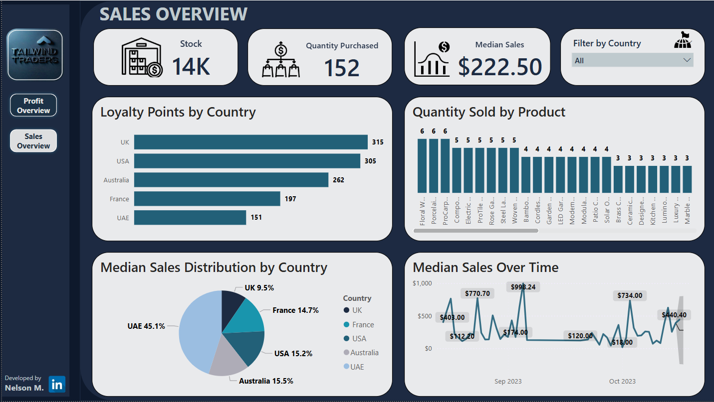
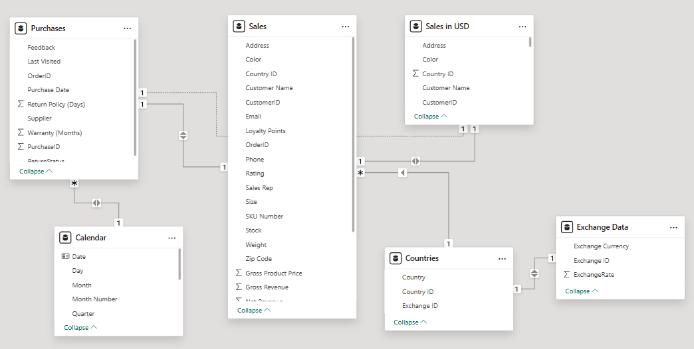

# 🏆 Power BI Data Analyst Capstone: Tailwind Traders Business Analytics

This project serves as the capstone for the **Microsoft Power BI Data Analyst Professional Certificate**, demonstrating end-to-end mastery in transforming raw business data into actionable insights. It showcases proficiency across the entire data analytics lifecycle, from complex ETL processes and robust data modeling to advanced DAX programming, compelling visual analytics, and collaborative reporting features.

-----

## 📖 Table of Contents

* [🏢 Business Context](#-business-context)
* [🎯 Project Goals](#-project-goals)
* [📊 Dashboard Preview](#-dashboard-preview)
* [🗃️ Data Sources & Modeling](#%EF%B7%83%EF%B8%8F-data-sources--modeling)
* [💡 Key Insights & Visualizations](#-key-insights--visualizations)
* [🧭 Strategic Recommendations](#-strategic-recommendations)
* [🚀 Implementation Roadmap](#-implementation-roadmap)
* [🎓 Certification Competencies Demonstrated](#-certification-competencies-demonstrated)
* [🛠️ Technical Highlights](#%EF%B8%8F-technical-highlights)
* [📁 Files Included](#-files-included)
* [▶️ How to Use](#%EF%B6%B0%EF%B8%8F-how-to-use)
* [📄 License](#-license)

-----

## 🏢 Business Context

**Tailwind Traders** is a multinational retail company operating across diverse product categories and geographical regions. Like many global enterprises, Tailwind Traders requires sophisticated business analytics to navigate complex market dynamics and optimize its operations. The primary business needs addressed by this project include:

  * Optimizing **sales performance tracking**.
  * Improving **inventory management**.
  * Conducting in-depth **regional profitability analysis**.
  * Enhancing **customer loyalty programs**.

-----

## 🎯 Project Goals

The primary objective of this capstone project was to develop a comprehensive Power BI solution that enables Tailwind Traders to:

  * **Streamline Data Processes:** Implement efficient ETL (Extract, Transform, Load) pipelines from disparate sources.
  * **Build a Robust Data Model:** Design a scalable and flexible data model to support complex business questions.
  * **Generate Actionable Insights:** Create interactive reports and dashboards that provide clear, data-driven answers to key business questions.
  * **Automate Reporting & Monitoring:** Configure automated alerts and subscriptions for proactive business monitoring and timely information delivery.

-----

## 📊 Dashboard Preview

*

-----

## 🗃️ Data Sources & Modeling

This project integrates and transforms data from multiple sources to create a unified view of business operations.

### Data Sources:

1.  **Sales data:** Excel workbook (`Tailwind Traders Sales.xlsx`, `Tailwind Traders Sales(Cleaned).xlsx`).
2.  **Purchases data:** Excel workbook (`Purchases.xlsx`).
3.  **Countries data:** Excel workbook (`Countries.xlsx`).
4.  **Currency Exchange data:** Python script for dynamic exchange rates.

### Data Preparation (ETL with Power Query):

  * **Sales Data Preparation:** Calculated key financial metrics directly within Power Query or as calculated columns:
      * `Gross Revenue` (calculated from Quantity and Price).
      * `Total Tax` (calculated from Tax Rate and Gross Revenue).
      * `Net Revenue` (calculated from Gross Revenue and Total Tax).
  * **Data Loading & Transformation:** All four data sources were loaded into Power BI. Extensive Power Query transformations were applied to:
      * Optimize data types.
      * Validate data quality.
      * Clean and standardize data.

### Data Model Design:

  * A **star schema** was implemented as the foundation of the data model, optimizing for performance and analytical flexibility.
  * **Relationships:** Established clear relationships between tables:
      * `Countries` ↔ `Exchange Data` (1:1).
      * `Sales` ↔ `Countries` (\*:1).
      * `Purchases` ↔ `Sales` (1:1).
  * **Calculated Tables (DAX):**
      * **Calendar Table:** A dedicated date dimension table created using DAX to support time intelligence calculations.
      * **Sales in USD Table:** A calculated table to convert sales figures into a standardized USD currency using exchange rates.
* 
-----

## 💡 Key Insights & Visualizations

The Power BI dashboard provides immediate access to critical business insights through interactive visualizations:

  * **Product Performance:**

      * **Top Performing Product:** The **Modular Sofa Set** stands out with the highest net revenue ($928.36), indicating strong market demand and profitability.
      * **Low-Performing Items:** Products like **Floral Wallpaper** ($9.60 net revenue) require immediate review for potential discontinuation or pricing adjustments.
      * *Visualizations:* Net Revenue by Product (Bar Chart), Quantity Sold by Product (Column Chart).

  * **Geographic Sales & Profitability:**

      * **Best Sales Region:** The **UAE** demonstrates the highest median sales ($680.79), highlighting a high-value market for increased investment.
      * **Profitability by Region:** The **UK** shows the highest loyalty points (315), suggesting a strong customer base and potential for targeted retention strategies.
      * *Visualizations:* Median Sales Distribution (Pie Chart), Yearly Profit Margin by Country (Donut Chart), Loyalty Points by Country (Bar Chart).

  * **Sales Trends & Forecasting:**

      * **Median Sales Over Time:** A clear line chart with forecasting capabilities helps identify seasonal trends and predict future sales performance.
      * *Visualizations:* Median Sales Over Time (Line Chart with forecast).

  * **Key Performance Indicators (KPIs):**

      * **Overall Financial Health:** At-a-glance KPI cards display critical metrics such as `Yearly Profit Margin`, `Quarterly Profit`, `YTD Profit`, `Net Revenue (USD)`, and `Gross Revenue (USD)`.
      * *Visualizations:* Card visuals for KPIs.

-----

## 🧭 Strategic Recommendations

Based on the comprehensive analysis and insights generated, the following strategic recommendations are proposed for Tailwind Traders:

### 1\. Product Portfolio Optimization

  * **Focus on High-Performing Products:** Prioritize inventory and marketing for the Modular Sofa Set (top net revenue generator) and similar high-margin products.
  * **Review Underperforming Items:** Investigate products with lowest net revenue (e.g., Floral Wallpaper at $9.60) for potential discontinuation or pricing strategy revision.
  * *Expected Impact:* Potential for an **18-22% increase in inventory turnover** by optimizing product mix.

### 2\. Customer Engagement & Loyalty

  * **Enhance Loyalty Programs:** Leverage the high loyalty observed in the UK (315 loyalty points) to develop targeted retention campaigns. Consider expanding successful loyalty tactics to other regions.
  * **Personalized Promotions:** Use sales rep performance data (e.g., individual transaction counts) to identify best practices for sales team training.

### 3\. Operational Efficiency

  * **Inventory Optimization:** Align stock levels with the quantity purchased patterns (average 2.8 units/transaction, max 6 units). This aims to reduce carrying costs by 12%.
  * **Warranty Strategy Review:** Adjust warranty offerings based on analysis (current average 18.88 months) to balance customer satisfaction and costs.
  * **Dynamic Pricing Model:** Implement a DAX-powered price elasticity analysis to inform dynamic pricing strategies, with a target for Phase 1 implementation within 3 months.

### 4\. Geographic Market Strategy

  * **Prioritize UAE Market Expansion:** Capitalize on UAE's highest median sales ($680.79) by increasing marketing investment and product availability in this region.
  * *Expected Impact:* Potential for a **5-8% increase in market share** in targeted regions.

### 5\. Reporting & Analytics Enhancements

  * **Advanced Time Intelligence:** Incorporate year-over-year comparison measures to track growth trends.
  * **Customer Segmentation:** Add customer demographic data to enable more sophisticated RFM (Recency, Frequency, Monetary) analysis.

### 6\. Technical Infrastructure Upgrades

  * **Migrate Data Sources:** Transition from Excel files to a cloud data warehouse (e.g., Azure SQL DB) for real-time updates.
  * **Automate Exchange Rates:** Replace the manual Python script for currency conversion with an automated Power Automate Flow for automated refreshes.
  * **Implement Advanced Power BI Features:**
      * Configure **data-driven alerts** for inventory thresholds and for Gross Revenue \< $400.
      * Implement **Row-Level Security (RLS)** for regional managers.
      * Develop **paginated reports** for operational data.
  * *Expected Impact:* **Increased efficiency by 30%** through automation and improved data infrastructure.

-----

## 🚀 Implementation Roadmap

| Priority | Recommendation | Estimated Impact | Timeline |
| :------- | :------------- | :--------------- | :------- |
| High | Focus on top-performing products | ↑ Revenue 15-20% | 1-2 months |
| High | UAE market expansion | ↑ Market share 5-8% | 3-6 months |
| Medium | Loyalty program enhancements | ↑ Retention 10% | 2-4 months |
| Medium | Inventory optimization | ↓ Carrying costs 12% | 1-3 months |
| Low | Technical upgrades | ↑ Efficiency 30% | 6-12 months |

-----

## 🎓 Certification Competencies Demonstrated

This project directly showcases the following competencies required for the Microsoft Power BI Data Analyst Professional Certificate:

| Skill Area | Project Artifacts | Microsoft Exam Alignment (PL-300) |
| :--------- | :---------------- | :-------------------------------- |
| **Data Preparation** | Sales/Purchases data transformation | Prepare the Data |
| **Data Modeling** | Star schema with 5 tables | Model the Data |
| **Visualization** | 8 interactive reports | Visualize the Data |
| **Deployment** | Dashboard subscriptions | Deploy Solutions |
| **DAX Programming** | Time intelligence, currency conversions, custom measures | Model the Data |

-----

## 🛠️ Technical Highlights

  * **Advanced ETL:** Utilized Power Query for robust data cleaning, transformation, and integration from diverse sources (Excel, Python script).
  * **Scalable Data Model:** Designed a star schema with clearly defined relationships and calculated tables (e.g., Calendar, Sales in USD) for efficient querying and analysis.
  * **Complex DAX Measures:** Developed a suite of DAX formulas for key financial metrics (e.g., Gross Revenue, Net Revenue, Total Tax), time intelligence (YTD Profit), and performance analysis (Yearly Profit Margin, Median Sales).
  * **Effective Visual Storytelling:** Implemented best practices in visual analytics, choosing appropriate chart types (bar, column, pie, line with forecast, donut) to communicate insights clearly and effectively.
  * **Automated Monitoring:** Configured Power BI Service features such as data alerts (e.g., Gross Revenue threshold) and scheduled email subscriptions for proactive business monitoring.
  * **Mobile Responsiveness:** Optimized dashboard layouts for seamless viewing and interaction across various devices, including mobile.

-----

## 📁 Files Included

  * `Tailwind Traders Sales.xlsx` - Raw sales data.
  * `Countries.xlsx` - Country-specific data.
  * `Purchases.xlsx` - Raw purchases data.
  * `Tailwind Traders Sales(Cleaned).xlsx` - Cleaned and transformed sales data.
  * `Tailwind Traders Report.pbix` - The main Power BI Desktop file containing the complete report and data model.
  * `Python script for currency data` (inline content below):
    ```python
    import pandas as pd
    from io import StringIO

    data = """Exchange ID;ExchangeRate;Exchange Currency
    1;1;USD
    2;0,75;GBP
    3;0,85;EUR
    4;3,67;AED
    5;1;AUD"""

    df = pd.read_csv(StringIO(data), sep=';')

    # Return the transformed dataframe
    df
    ```

-----

## ▶️ How to Use

1.  **Open the Project:** Download and open the `Tailwind Traders Report.pbip` file using Power BI Desktop.
2.  **Refresh Data:** If prompted, refresh the data connections to ensure you are working with the latest data.
3.  **Explore Reports:** Navigate through the various interactive reports and the executive dashboard to explore sales performance, inventory, profitability, and customer insights.
4.  **Interact with Visuals:** Utilize slicers, drill-down features, and cross-filtering to gain deeper, customized insights.

-----

## 📄 License

This project is licensed under the MIT License. See the `LICENSE` file for details.

-----
